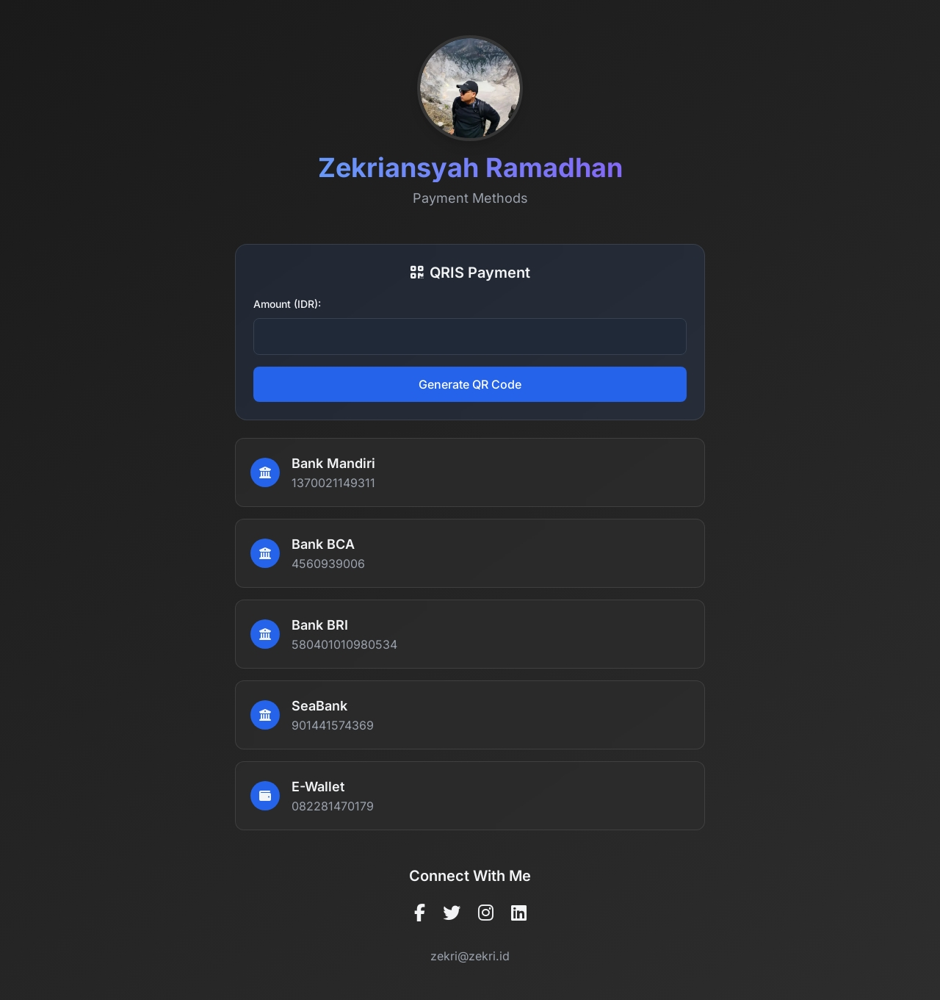

# Bank Account List and QRIS Generator



## Description

This project is an interactive web page designed to display a list of bank accounts, e-wallets, and a QRIS generator. With a modern interface powered by TailwindCSS, users can:

- Copy bank account or e-wallet numbers with one click.
- Generate QR Codes for QRIS payments with customizable amounts.
- Connect to your social media profiles via clickable icons.

## Technologies Used

- **HTML**: Basic page structure.
- **CSS**: Styling with [TailwindCSS](https://tailwindcss.com).
- **JavaScript**: Interactive features like QRIS generator and clipboard copying.
- **Font Awesome**: Icons for visual elements.

## Features

1. **Bank Account List**:
   - Displays information for bank accounts and e-wallets.
   - Unique icons for each account type.
   - Copy account numbers to clipboard.

2. **QRIS Generator**:
   - Input form for specifying amount (IDR).
   - Automatically generates scannable QR Codes.

3. **Social Media Links**:
   - Direct links to your social media profiles.

4. **Modern Design**:
   - Dark theme with hover effects.
   - Fully responsive layout.

## How to Use

1. Clone this repository:
   ```bash
   git clone https://github.com/zexry619/pay.zekri.id.git
   ```

2. Open the `index.html` file in your browser.

3. Explore the features:
   - Click on a bank account to copy the account number.
   - Enter an amount and click "Generate QR Code" to create a QRIS payment code.

## Live Demo
Visit the live demo at [pay.zekri.id](https://pay.zekri.id).

## Contributing

1. Fork this repository.
2. Create a new branch:
   ```bash
   git checkout -b new-feature
   ```
3. Commit your changes:
   ```bash
   git commit -m "Add new feature"
   ```
4. Push to your branch:
   ```bash
   git push origin new-feature
   ```
5. Create a Pull Request.

## License

This project is licensed under the [MIT License](LICENSE).

## Contact

- **Email**: [zekri@zekri.id](mailto:me@zekri.id)
- **Facebook**: [zexry4rt](https://www.facebook.com/zexry4rt)
- **Twitter**: [zekrisme](https://www.twitter.com/zekrisme)
- **Instagram**: [zekrisme](https://www.instagram.com/zekrisme)
- **LinkedIn**: [Zekriansyah Ramadhan](https://www.linkedin.com/in/zekriansyah-ramadhan-901038129)
